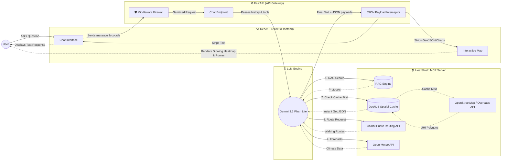
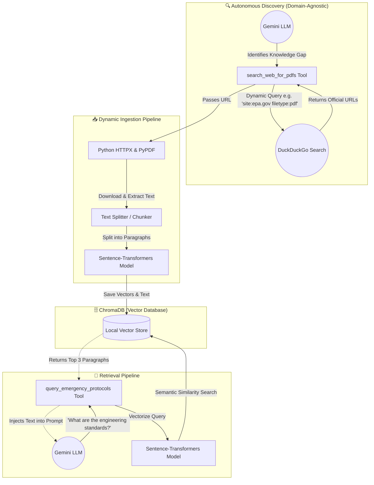

# 🏗️ HeatShield: Advanced Spatial RAG Architecture

This document visually breaks down exactly how the HeatShield project operates. It is designed as an Agentic Spatial Analytics Platform for urban climate resilience.

> [!TIP]
> **Core Architecture:** HeatShield uses a **Model Context Protocol (MCP)** backend to orchestrate complex spatial algorithms, real-time meteorological data, and a Vector Database for grounded medical protocols.

---

## 1. System Overview

HeatShield is an **Agentic Spatial Analytics Platform** designed for urban climate resilience. It uses a **Model Context Protocol (MCP)** backend to orchestrate complex spatial algorithms, real-time meteorological data, and a Vector Database for grounded medical protocols.

### 🌐 Frontend (React + Vite + Leaflet)
* **Glassmorphism UI:** Modern, responsive chat interface.
* **Spatial Rendering:** Uses `react-leaflet` to render custom GeoJSON Polygon overlays (not just standard pins) to visualize Urban Heat Islands (UHI).
* **Data Visualization:** Uses `recharts` to render dismissible, multi-axis predictive widgets for Soil Moisture and Air Quality forecasting.
* **Geolocation Native:** Automatically requests browser geolocation on mount to instantly contextualize emergency data.

### 🧠 Backend Orchestration (FastAPI + MCP + Gemini)
* **API Gateway:** A FastAPI layer (`api.py`) receives chat messages and intercepts structured spatial payloads (GeoJSON/Forecasts) before passing them to the frontend.
* **LLM Engine:** Uses the `openai` Python SDK (pointed at Gemini 3.5 Flash Lite) with function-calling capabilities.
* **MCP Server (`server.py`):** Encapsulates all spatial tools using the open-standard Model Context Protocol. This makes the tools agnostic and reusable by any agentic framework.

---

## 2. The Agentic Tool Stack (MCP)

When the user asks a question, Gemini has access to the following deterministic tools:

### 🗺️ OpenStreetMap & OSRM Integration
1. `geocode_location`: Resolves string addresses into exact coordinates using Nominatim.
2. `search_cooling_spots`: Queries OSM for nearby parks and fountains, and uses **OSRM (Open Source Routing Machine)** to calculate true walking distances (not crow-flies distance).
3. `generate_uhi_heatmap`: **(Advanced)** Extracts exact geographic polygon geometries (buildings, parking lots vs forests, parks) using the Overpass API. It uses a **DuckDB Spatial Cache** to store processed 1km grids locally with a **30-day TTL (Time To Live)**, preventing API rate limits and dropping load times from 10s to 50ms while ensuring city infrastructure stays up to date.
4. `get_walking_route`: **(Advanced)** Uses OSRM to generate multiple alternative walking paths, and uses `shapely` geometric intersection against the DuckDB UHI cache to calculate "heat exposure." The tool returns a Shade-Optimized route that algorithmically avoids hot areas.

### 🌤️ Real-Time & Predictive Climate Data
5. `get_weather_and_heat_risk`: Fetches live Open-Meteo data and calculates WHO/CDC Risk Levels.
6. `get_heatwave_forecast`: Analyzes a 7-day forecast, specifically correlating High Temperatures with **Soil Moisture/Drought** data to calculate a "Climate Aggravation Risk."
7. `get_air_quality_forecast`: Fetches a 5-day predictive trajectory of PM10 (dust) and PM2.5 (smoke), crucial during dry heatwaves.

### 📚 Spatial RAG (Retrieval-Augmented Generation)
8. `query_emergency_protocols`: **(Advanced)**
   * **Database:** Uses a local **ChromaDB** Vector Database.
   * **Embeddings:** Uses `sentence-transformers` (`all-MiniLM-L6-v2`) to convert text into high-dimensional vectors.
   * **Function:** When asked for advice, it performs a semantic similarity search across ingested PDFs, injecting the exact medical/engineering guidelines into the prompt to completely eliminate LLM hallucinations.
9. `ingest_emergency_document_url`: **(Dynamic Ingestion)** Allows the AI to download external PDFs (e.g., from the WHO, EPA, ASHRAE) or text documents via URL, extract the text using `pypdf`, chunk it, and dynamically insert the embeddings into ChromaDB at runtime so it is instantly searchable.
10. `search_web_for_pdfs`: **(Autonomous Discovery)** Uses the `duckduckgo-search` library to autonomously scour the web for official PDFs when the AI encounters a knowledge gap. This tool is **100% domain-agnostic**—the AI formulates its own queries (e.g., `site:who.int medical guidelines`, `site:epa.gov urban heat`, `site:ashrae.org building standards`) enabling zero-configuration web intelligence without paid APIs.

---

## 3. Data Flow & Architecture Diagrams

### A. Core System Orchestration
This diagram shows how the FastAPI backend routes chat messages to Gemini, and how Gemini orchestrates the various spatial and climate tools.

### B. Autonomous RAG Pipeline (Discovery & Ingestion)
This diagram specifically breaks down how the system autonomously hunts for external PDFs using DuckDuckGo, vectorizes them, and retrieves them during a conversation without relying on the LLM to read the entire web.

### C. Optimized RAG Sequence Diagram (With Reasoning Phase)
This sequence diagram illustrates the advanced **Task Decomposition & Chain-of-Thought (CoT)** architecture. Instead of blindly executing tools, the AI is forced into a Reasoning Phase to parse intent and formulate a plan before triggering the execution phase.

```mermaid
sequenceDiagram
    actor User
    participant Frontend as React UI
    participant Agent as Gemini LLM
    participant Search as DuckDuckGo Tool
    participant Ingest as PyPDF / Chunker
    participant Chroma as ChromaDB
    participant RAG as Retrieval Tool

    User->>Frontend: "What roofing materials mitigate urban heat?"
    Frontend->>Agent: Forward query
    
    rect rgb(30, 41, 59)
    note right of Agent: 🧠 REASONING PHASE (Chain-of-Thought)
    Agent->>Agent: 1. Intent Analysis: Engineering knowledge requested.
    Agent->>Agent: 2. Gap Identification: Missing ASHRAE/EPA roofing standards.
    Agent->>Agent: 3. Execution Plan: Search Web -> Ingest -> Query RAG.
    end
    
    rect rgb(15, 23, 42)
    note right of Agent: 🛠️ EXECUTION PHASE
    Agent->>Search: search_web_for_pdfs("site:epa.gov high albedo roofing filetype:pdf")
    Search-->>Agent: Returns Official PDF URL
    Agent->>Ingest: ingest_emergency_document_url(URL)
    Ingest->>Ingest: Download & Extract text
    Ingest->>Ingest: Split text into 1000-char chunks
    Ingest->>Chroma: Generate embeddings & store
    Chroma-->>Agent: Returns "Ingestion Complete"
    Agent->>RAG: query_emergency_protocols("high albedo roofing materials")
    RAG->>Chroma: Semantic similarity search
    Chroma-->>RAG: Returns top 3 matching paragraphs
    RAG-->>Agent: Inject exact text into context
    end
    
    Agent->>Frontend: Generate grounded, hallucination-free response
    Frontend-->>User: Display answer with citations
```

### D. UC4: Medical Triage & Emergency Broadcast Flow
This diagram maps how the system handles critical health escalations (User says "I don't feel well").

```mermaid
sequenceDiagram
    actor User
    participant Frontend as React UI
    participant Agent as Gemini LLM
    participant TriageTool as display_medical_triage_advice
    participant AlertTool as broadcast_emergency_alert
    participant WS as WebSocket Server

    User->>Frontend: "I don't feel well"
    Frontend->>Agent: trigger_symptom_triage_ui()
    Frontend-->>User: Renders SymptomTriageCard
    User->>Frontend: Selects "Dizziness or fainting"
    Frontend->>Agent: "I am experiencing: Dizziness..."
    
    rect rgb(30, 41, 59)
    note right of Agent: 🩺 TRIAGE PHASE
    Agent->>Agent: Recognizes medical request
    Agent->>TriageTool: display_medical_triage_advice(severity, steps)
    TriageTool-->>Frontend: Structured JSON payload
    Frontend-->>User: Renders High-Visibility .msg-emergency Card
    end

    User->>Frontend: Clicks "CALL EMERGENCY SERVICES" button
    Frontend->>Agent: "EMERGENCY: I am calling emergency services!"
    
    rect rgb(15, 23, 42)
    note right of Agent: 🚨 EMERGENCY BROADCAST PHASE
    Agent->>AlertTool: broadcast_emergency_alert("CRITICAL", "Medical Emergency")
    AlertTool->>WS: Push payload to all connected clients
    WS-->>Frontend: Emergency WS Event
    Frontend-->>User: Flashing Red AlertBanner Overlay
    end
```

