# 🏗️ HeatShield: Advanced Spatial RAG Architecture

This document visually breaks down exactly how the HeatShield project operates. It is designed as an Agentic Spatial Analytics Platform for urban climate resilience.

> [!TIP]
> **Core Architecture:** HeatShield uses a **Model Context Protocol (MCP)** backend to orchestrate complex spatial algorithms, real-time meteorological data, and a Vector Database for grounded medical protocols.

---

## 1. System Overview

HeatShield is an **Agentic Spatial Analytics Platform** designed for urban climate resilience. It uses a **Model Context Protocol (MCP)** backend to orchestrate complex spatial algorithms, real-time meteorological data, and a Vector Database for grounded medical protocols.

### 🌐 Frontend (React + Vite + Leaflet)
* **Glassmorphism UI:** Modern, responsive chat interface.
* **Spatial Rendering:** Uses `react-leaflet` to render custom GeoJSON Polygon overlays (not just standard pins) to visualize Urban Heat Islands (UHI).
* **Data Visualization:** Uses `recharts` to render dismissible, multi-axis predictive widgets for Soil Moisture and Air Quality forecasting.
* **Geolocation Native:** Automatically requests browser geolocation on mount to instantly contextualize emergency data.

### 🧠 Backend Orchestration (FastAPI + MCP + Gemini)
* **API Gateway:** A FastAPI layer (`api.py`) receives chat messages and intercepts structured spatial payloads (GeoJSON/Forecasts) before passing them to the frontend.
* **LLM Engine:** Uses the `openai` Python SDK (pointed at Gemini 1.5 Flash) with function-calling capabilities.
* **MCP Server (`server.py`):** Encapsulates all spatial tools using the open-standard Model Context Protocol. This makes the tools agnostic and reusable by any agentic framework.

---

## 2. The Agentic Tool Stack (MCP)

When the user asks a question, Gemini has access to the following deterministic tools:

### 🗺️ OpenStreetMap Humanitarian Integration
1. `geocode_location`: Resolves string addresses into exact coordinates using Nominatim.
2. `search_cooling_spots`: Calculates the Haversine distance to nearby parks and fountains using the Overpass QL.
3. `generate_uhi_heatmap`: **(Advanced)** Extracts exact geographic polygon geometries (buildings, parking lots vs forests, parks) using the Overpass API. It generates a GeoJSON `FeatureCollection` to render red "heat traps" and green "cooling zones" on the frontend.

### 🌤️ Real-Time & Predictive Climate Data
4. `get_weather_and_heat_risk`: Fetches live Open-Meteo data and calculates WHO/CDC Risk Levels.
5. `get_heatwave_forecast`: Analyzes a 7-day forecast, specifically correlating High Temperatures with **Soil Moisture/Drought** data to calculate a "Climate Aggravation Risk."
6. `get_air_quality_forecast`: Fetches a 5-day predictive trajectory of PM10 (dust) and PM2.5 (smoke), crucial during dry heatwaves.

### 📚 Spatial RAG (Retrieval-Augmented Generation)
7. `query_emergency_protocols`: **(Advanced)**
   * **Database:** Uses a local **ChromaDB** Vector Database.
   * **Embeddings:** Uses `sentence-transformers` (`all-MiniLM-L6-v2`) to convert text into high-dimensional vectors.
   * **Function:** When asked for safety advice, it performs a semantic similarity search across official WHO and Urban Planning protocols, injecting the exact medical guidelines into the prompt to completely eliminate LLM hallucinations.

---

## 3. Data Flow Diagram

```mermaid
graph LR
    %% User and Interface
    User((User))
    
    subgraph Frontend ["💻 React + Leaflet (Frontend)"]
        Chat[Chat Interface]
        Map[Interactive Map]
    end
    
    subgraph Backend ["⚙️ FastAPI (API Gateway)"]
        Router[Chat Endpoint]
        Parser[JSON Payload Interceptor]
    end
    
    subgraph AI ["🧠 LLM Engine"]
        Agent((Gemini 3.5 Flash Lite))
    end
    
    subgraph Tools ["🛠️ HeatShield MCP Server"]
        RAG[(ChromaDB Vector Store)]
        OSM[OpenStreetMap / Overpass API]
        Weather[Open-Meteo API]
    end
    
    %% Flows
    User -->|Asks Question| Chat
    Chat -->|Sends message & coords| Router
    Router -->|Passes history & tools| Agent
    
    Agent -->|Invokes RAG Tool| RAG
    Agent -->|Invokes UHI Tool| OSM
    Agent -->|Invokes Forecast Tool| Weather
    
    RAG -.->|Returns Protocols| Agent
    OSM -.->|Returns GeoJSON Polygons| Agent
    Weather -.->|Returns Live Climate Data| Agent
    
    Agent -->|Final Text + JSON payloads| Parser
    Parser -->|Strips Text| Chat
    Parser -->|Strips GeoJSON/Charts| Map
    
    Chat -.->|Displays Text Response| User
    Map -.->|Renders Glowing Heatmap| User
```

