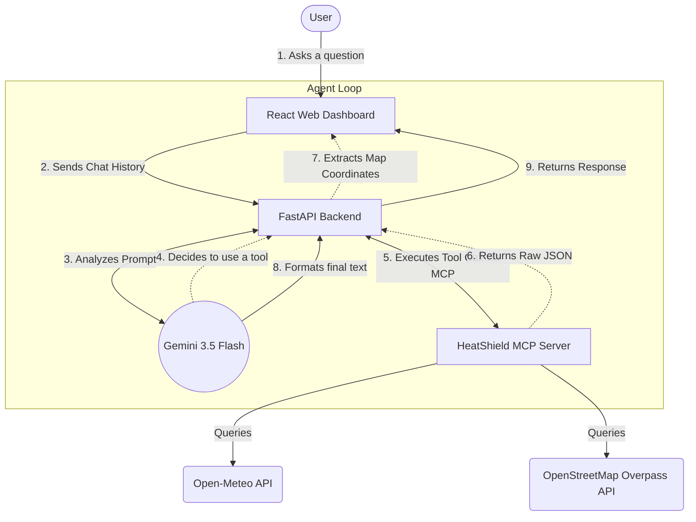
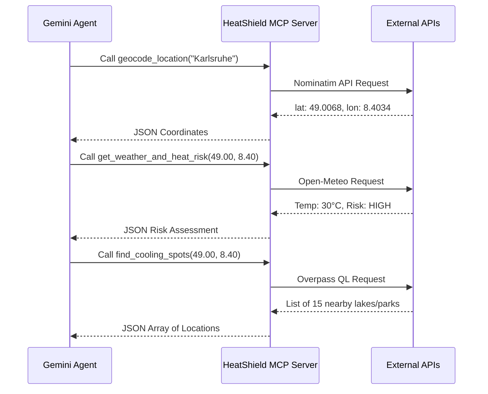
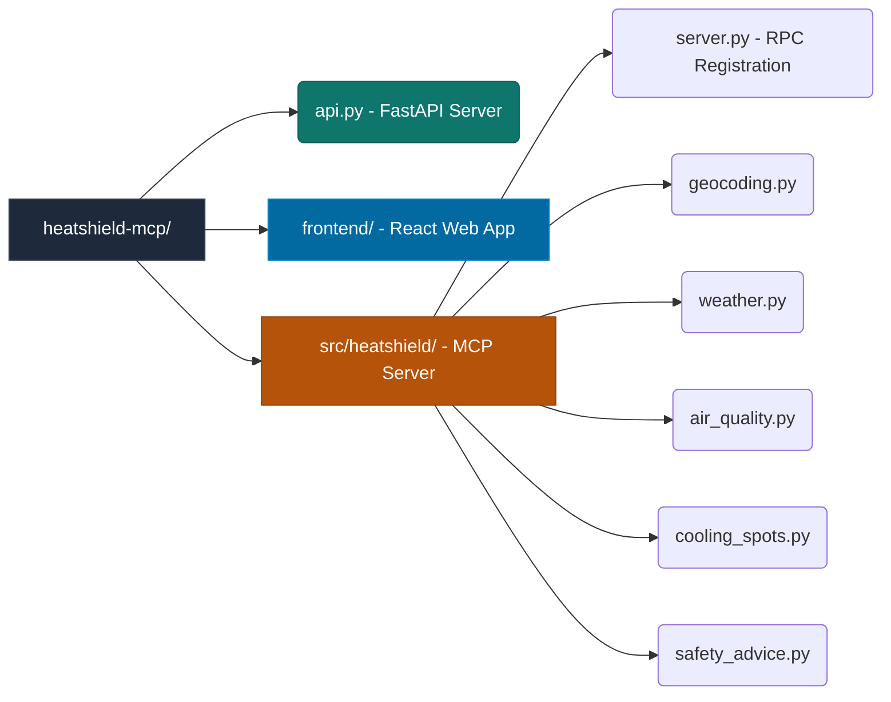

# HeatShield GeoAgent Architecture

This document visually breaks down exactly how the HeatShield project operates. You can use these diagrams to study for your interview and explain the data flow to Shoaib.

> [!TIP]
> The core value proposition of this architecture is that **the AI does not guess geographic data**. It acts strictly as an orchestrator, while the MCP Server acts as the factual data retrieval engine.

## High-Level System Flow

---

## The Model Context Protocol (MCP) Boundary

The MCP Server is completely isolated from the AI. This means you can swap out Gemini for Claude or ChatGPT, and the tools will still work identically.

---

## Directory Structure

Here is how your codebase is physically organized to support this architecture:

> [!IMPORTANT]
> **Decoupled Logic:** Notice how the `src/heatshield/` folder separates `server.py` from the individual tool files (`geocoding.py`, `weather.py`, etc.). This is a best practice that makes the tools testable without needing to boot up the entire MCP server!
