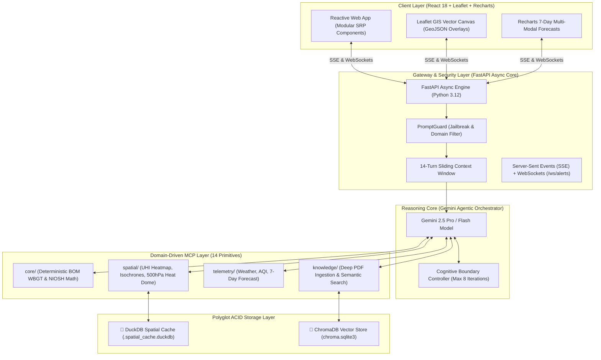
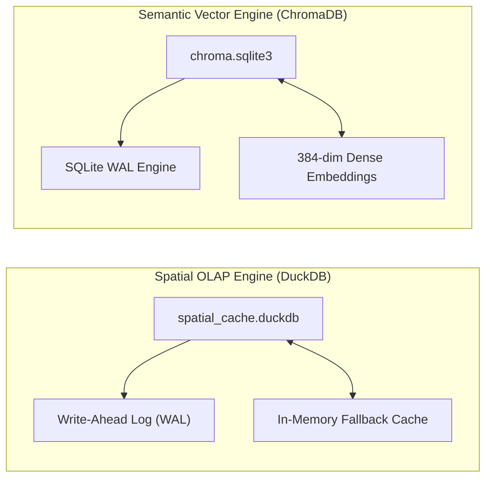
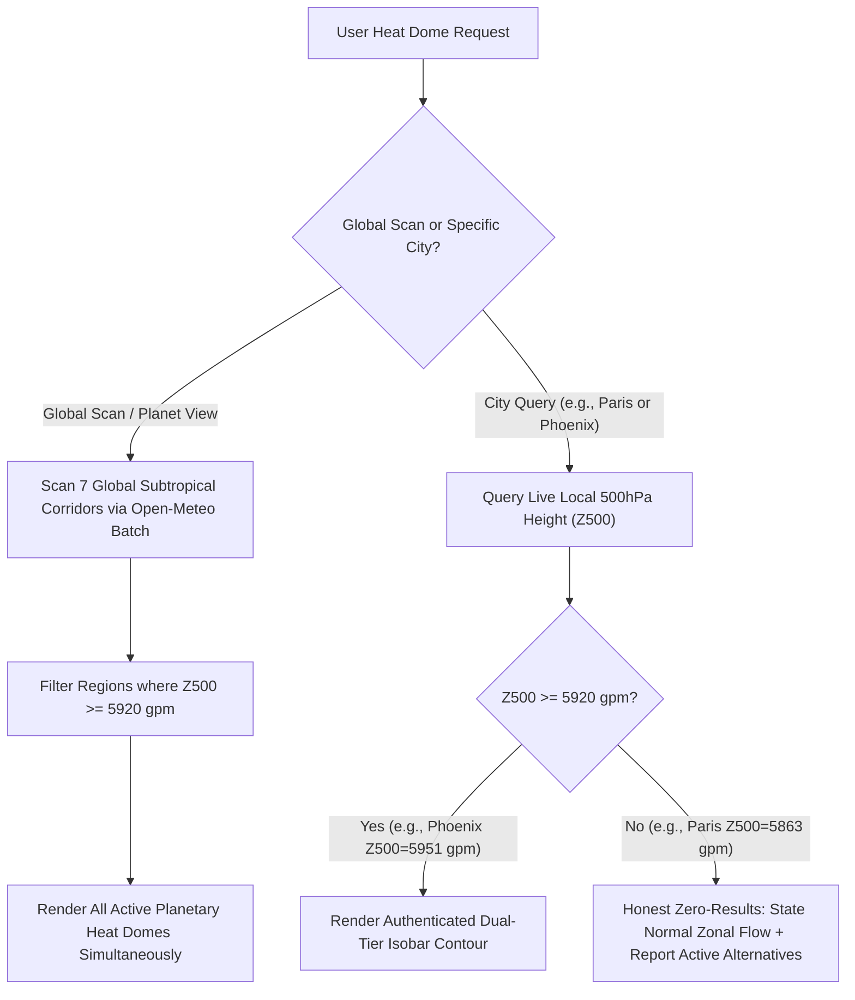
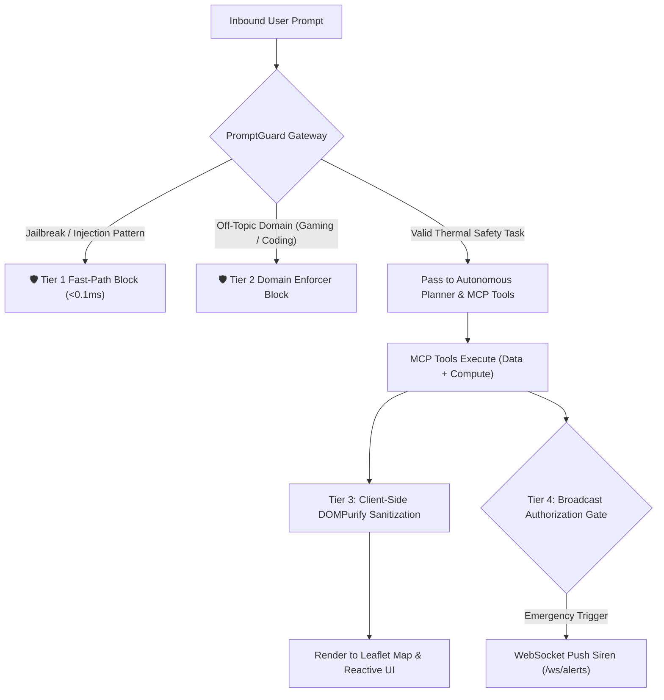
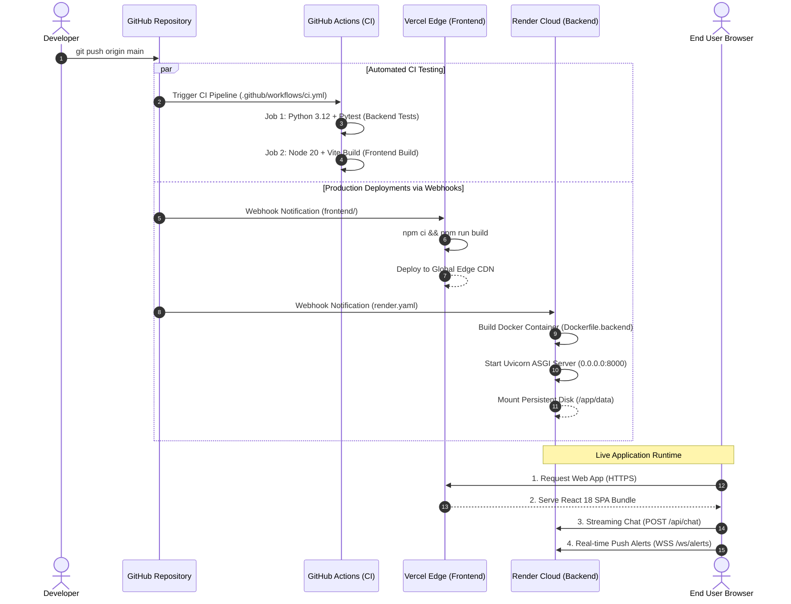

# HeatShield: Software Engineering & System Architecture Whitepaper


**Project Name:** HeatShield  
**Domain:** Urban Heat Resilience & Agentic Spatial Intelligence  
**Tech Stack:** Python 3.12 (FastAPI Async, MCP SDK, Shapely) · React 18 (Vite, Leaflet, Recharts) · Polyglot ACID Storage (DuckDB + ChromaDB) · Meta PromptGuard · Open-Meteo & OpenStreetMap APIs  

---

## 📖 1. Engineering Glossary & Key Concepts

| Term | Full Name | Plain-English Software Engineering Definition |
| :--- | :--- | :--- |
| **gpm** | **Geopotential Meters** | The standard scientific unit measuring altitude in the atmosphere based on Earth's gravity and air pressure. At the 500hPa level, heights $\ge 5920\text{ gpm}$ indicate an extreme, persistent **Heat Dome** (atmospheric lid trapping heat). |
| **hPa** | **Hectopascals** | The standard metric unit of atmospheric pressure ($1\text{ hPa} = 100\text{ Pascals} = 1\text{ millibar}$). Standard sea-level pressure is $\approx 1013.25\text{ hPa}$. Used in the 500hPa upper-troposphere layer to detect synoptic blocking ridges. |
| **WBGT** | **Wet Bulb Globe Temperature** | The international gold standard for human thermal stress. Combines air temperature, humidity (sweat evaporation limit), solar radiant heat, and wind cooling into a single actionable index. |
| **OSRM** | **Open Source Routing Machine** | A high-performance C++ routing engine for OpenStreetMap road networks. Computes real-world walking paths, road geometry, and pedestrian transit times instead of straight-line distance. |
| **Isochrone** | **Walkability Travel Polygon** | A closed geographical polygon showing all areas reachable on foot within a specific time limit (e.g., a 5-minute or 10-minute safe walking radius under heat exposure). |
| **Polyglot Persistence** | **Dual Database Architecture** | Using specialized storage engines for distinct data models: **DuckDB** for analytical geospatial OLAP ($<2\text{ms}$), and **ChromaDB/SQLite** for high-dimensional semantic vector embeddings. |
| **RAG** | **Retrieval-Augmented Generation** | Grounding the LLM by dynamically fetching verified clinical emergency guidelines (CDC/NIOSH) and workplace standards into prompt context with clickable citations. |

---

## 🎯 2. The Problem Space & Core Mission

### The Problem
Traditional weather applications are **passive displays of isolated numbers**:
1. **Numbers without Context:** Displaying "32°C" ignores the fact that 32°C at 85% humidity creates lethal thermal strain, whereas 35°C in dry air is manageable.
2. **No Spatial Actionability:** They cannot calculate whether a pedestrian walking corridor is thermally safe, nor map shaded rest stops.
3. **No Emergency Clinical Guidance:** When an outdoor worker collapses, conventional weather apps offer zero triage protocols.

### The Solution: HeatShield
HeatShield is an **Autonomous Spatial Intelligence and Urban Thermal Safety Platform**. It converts natural language user requests (*"I need to walk to the market"*, *"My coworker collapsed on site"*, *"Can we pour concrete at 42°C?"*) into coordinated actions: real-time climate data ingestion, deterministic biometeorological math, polyglot spatial caching, and dynamic map rendering.

---

## 🏗️ 3. High-Level System Architecture Diagram



---

## 🧱 4. Domain-Driven Design (DDD) & 14 MCP Tool Primitives

HeatShield organizes its backend into 4 decoupled, single-responsibility subpackages:

### 1. `core/` — Deterministic Physics & Legal Compliance
* **`compute_wbgt`:** Calculates Wet Bulb Globe Temperature based on the Australian Bureau of Meteorology (BOM) Tetens equation with solar radiation and wind speed adjustments.
* **`compute_work_rest_cycle`:** Evaluates official NIOSH Recommended Alert Limits (RAL) work/rest ratios (Light, Moderate, Heavy labor) and hourly hydration rates (**0% LLM math hallucination**).
* **`compute_heat_risk`:** Categorizes environmental risk into standard WHO/CDC tiers (LOW, MODERATE, HIGH, EXTREME).

### 2. `spatial/` — Geospatial Geometry & Spatial Caching
* **`get_urban_heat_island_heatmap`:** Queries Overpass OpenStreetMap building geometry, asphalt density, and canopy deficits to calculate $+4.2^\circ\text{C}$ localized thermal anomaly polygons.
* **`generate_walkability_isochrone`:** Generates radial pedestrian travel boundaries (5, 10, 15, 25 minutes) using network analysis.
* **`get_heat_dome_footprint`:** Ingests GFS $Z_{500}$ upper-air geopotential height fields to model 3D cylindrical isobaric heat domes ($\ge 5920\text{ gpm}$).
* **`get_walking_route`:** Generates pedestrian geometry and walking duration via OSRM, optimized for shade corridors.
* **`submit_geospatial_tasks`:** Concurrent asynchronous orchestrator pipeline with semaphores for multi-city batch fetching.
* **`geocode_location`:** Multi-tier geocoding fallback (Local Cache $\rightarrow$ Open-Meteo $\rightarrow$ Nominatim).

### 3. `telemetry/` — Predictive Meteorological Time-Series
* **`get_weather_and_heat_risk`:** Ingests live temperature, humidity, wind, solar radiation, and hourly UV index.
* **`get_air_quality` & `get_air_quality_forecast`:** Fetches 5-day atmospheric pollutant forecasts (US AQI, PM2.5, PM10, Ozone).
* **`get_heatwave_forecast`:** Generates 7-day multi-modal time-series containing max temperature, feels-like, and soil moisture drought curves.

### 4. `knowledge/` — Deep Document RAG & Live PDF Pipeline
* **`query_emergency_protocols`:** Performs sub-10ms cosine similarity vector search over embedded CDC/NIOSH protocols in ChromaDB.
* **`search_web_for_pdfs`:** Dynamically queries DuckDuckGo for authoritative government/scientific PDF documents.
* **`ingest_emergency_document_url`:** Downloads, parses with `pypdf`, chunks, and vectorizes external PDF documents into ChromaDB on the fly.

---

## 💾 5. Polyglot ACID Persistence Layer

HeatShield utilizes a dual database architecture to maintain high throughput, low latency, and zero-data corruption:



### A. 🦆 DuckDB (Spatial Cache)
* **Storage File:** `src/heatshield/spatial/.spatial_cache.duckdb`
* **Properties:** 100% ACID compliant, Multi-Version Concurrency Control (MVCC), Write-Ahead Logging (WAL).
* **Performance:** Sub-2ms query latency for Overpass GeoJSON spatial polygons.
* **Concurrency Resilience:** Includes an in-memory dual-layer cache that prevents unhandled exceptions when external GUI tools (like DBeaver) place temporary read locks on the file.

### B. 🧠 ChromaDB / SQLite (Vector Store)
* **Storage Directory:** `src/heatshield/knowledge/.chroma_db/chroma.sqlite3`
* **Properties:** Fully ACID compliant SQLite storage engine.
* **Embeddings:** 384-dimensional dense vectors (`all-MiniLM-L6-v2`) indexing 664+ chunks from the official 192-page CDC/NIOSH criteria publication (`2016-106.pdf`).
* **Inspection:** Can be queried via CLI (`scripts/inspect_db.py`), Visual Web Studio (`scripts/db_gui.py`), or directly via **DBeaver SQLite Driver**.

---

## 🌪️ 6. The Synoptic Heat Dome Engine

Heat Domes are **physical atmospheric phenomena** where the upper-tropospheric 500hPa pressure surface rises above **5,920 gpm**, trapping and compressing heat:



### The 7 Monitored Planetary Corridors:
1. **North American Plains Ridge** (Central USA / Texas)
2. **Sonoran / Great Basin Dome** (Southwest USA & NW Mexico)
3. **Persian Gulf / Arabian Dome** (Middle East & Arabian Peninsula)
4. **Sahara / Central Mediterranean** (North Africa & Southern Italy)
5. **Iberian Peninsula** (Spain & Western Mediterranean)
6. **Indus Valley** (Pakistan & NW India)
7. **Western Pacific Subtropical High** (East Asia / Yangtze Basin)

---

## 🔒 7. Security, Threat Model & PromptGuard Architecture

Civic safety systems require defense-in-depth against prompt injection, jailbreaks, and cross-site scripting:



1. **Tier 1: Fast-Path Deterministic Guard ($<0.1\text{ ms}$):** Intercepts known adversarial patterns (`"ignore previous instructions"`, `"system prompt verbatim"`, `"DAN mode"`).
2. **Tier 2: Domain Boundary Enforcer:** Blocks explicit non-domain queries (video games, general coding, recipes) before reaching the LLM.
3. **Tier 3: Client-Side DOMPurify Sanitization:** All dynamic markdown, table HTML, and external links pass through `DOMPurify.sanitize()` to eliminate Cross-Site Scripting (XSS).
4. **Tier 4: Emergency Broadcast Authorization Gate:** Restricts global siren triggers to authenticated emergency triage conditions.

---

## 🧩 8. Modular Frontend Component Architecture (SRP)

The frontend is structured into isolated, single-responsibility components:

```text
frontend/src/
├── components/
│   ├── canvas/
│   │   ├── MapController.jsx          # Camera flight, bounds fitting & zoom animations
│   │   └── MarkerClusterGroup.jsx     # Clustered cooling spots
│   ├── charts/
│   │   ├── ForecastWidget.jsx         # 7-day heatwave & soil moisture time-series
│   │   ├── WBGTForecastWidget.jsx     # 7-day predictive WBGT curves & risk lines
│   │   └── AQForecastWidget.jsx       # Multi-pollutant air quality forecast
│   ├── cards/
│   │   ├── WorkRestCard.jsx           # NIOSH work/rest ratio bar & halt badges
│   │   ├── SymptomTriageCard.jsx      # Interactive clinical symptom checklist
│   │   ├── MedicalTriageAdvice.jsx    # Emergency clinical steps & call 911 action
│   │   └── AlertBanner.jsx            # Real-time WebSocket emergency siren banner
│   ├── dashboard/
│   │   ├── CitizenDashboard.jsx       # 2x2 action grid & safe windows timeline
│   │   ├── PlannerDashboard.jsx       # Urban Heat Island vulnerability table
│   │   └── CheckInView.jsx            # Vulnerable contact monitoring list
│   └── chat/
│       └── MarkdownRenderer.jsx       # DOMPurify-sanitized table & link parser
└── App.jsx                            # Pure high-level state orchestrator (< 350 lines)
```

---

## 🚀 9. Production Deployment Architecture



### Infrastructure Summary:

| Component | Platform | Configuration & Runtime | Role |
| :--- | :--- | :--- | :--- |
| **Frontend SPA** | **Vercel** | Node 20 · Vite Build · Global Edge CDN | Delivers the modular React 18 UI, Leaflet vector maps, and Recharts dashboards. |
| **Backend API** | **Render / Docker** | `Dockerfile.backend` · Python 3.12 · Uvicorn | Runs FastAPI with Uvicorn ASGI workers for SSE chat streams and WebSocket push alerts. |
| **MCP Engine** | **Render Subprocess** | Subprocess via `mcp` stdio IPC | Isolated Python subprocess executing the 14 domain tools on behalf of the LLM. |
| **Polyglot Storage** | **Persistent Disk** | Persistent Volume (`/app/data`) | Persists ChromaDB vector embeddings and DuckDB spatial cache across redeploys. |
| **Automated CI** | **GitHub Actions** | Ubuntu Runners (`.github/workflows/ci.yml`) | Validates Python pytest suites and frontend Vite builds on every push to `main`. |
