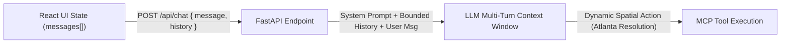
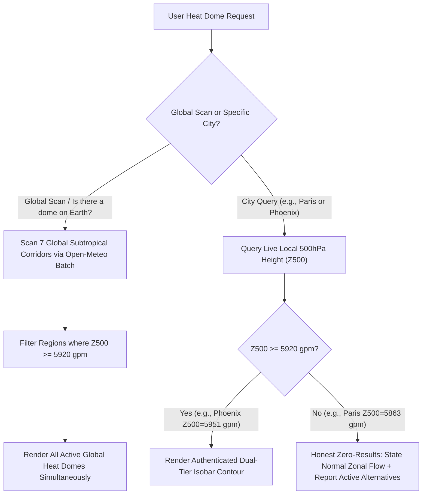
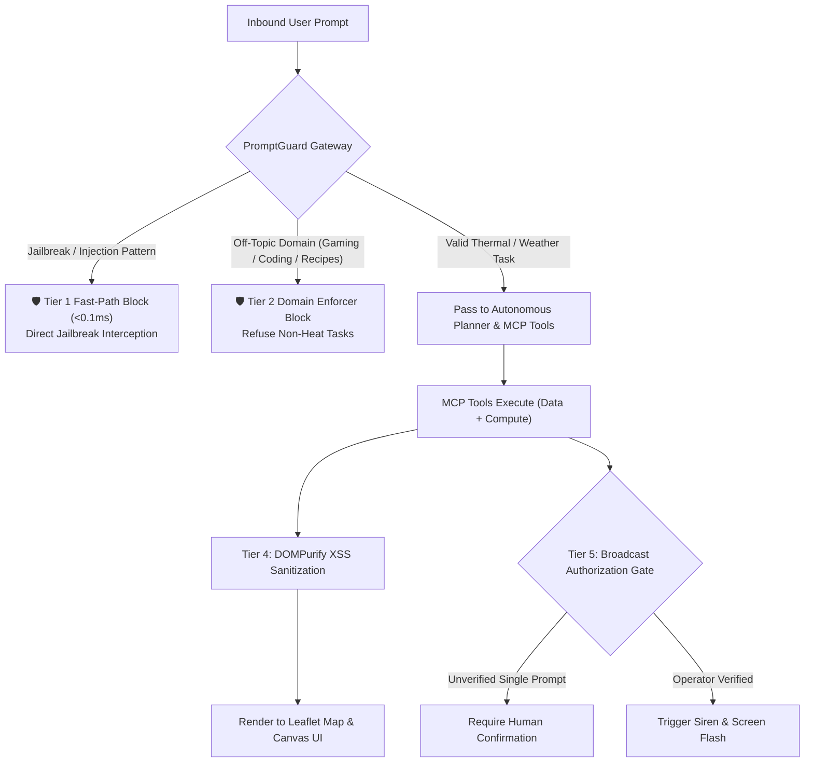
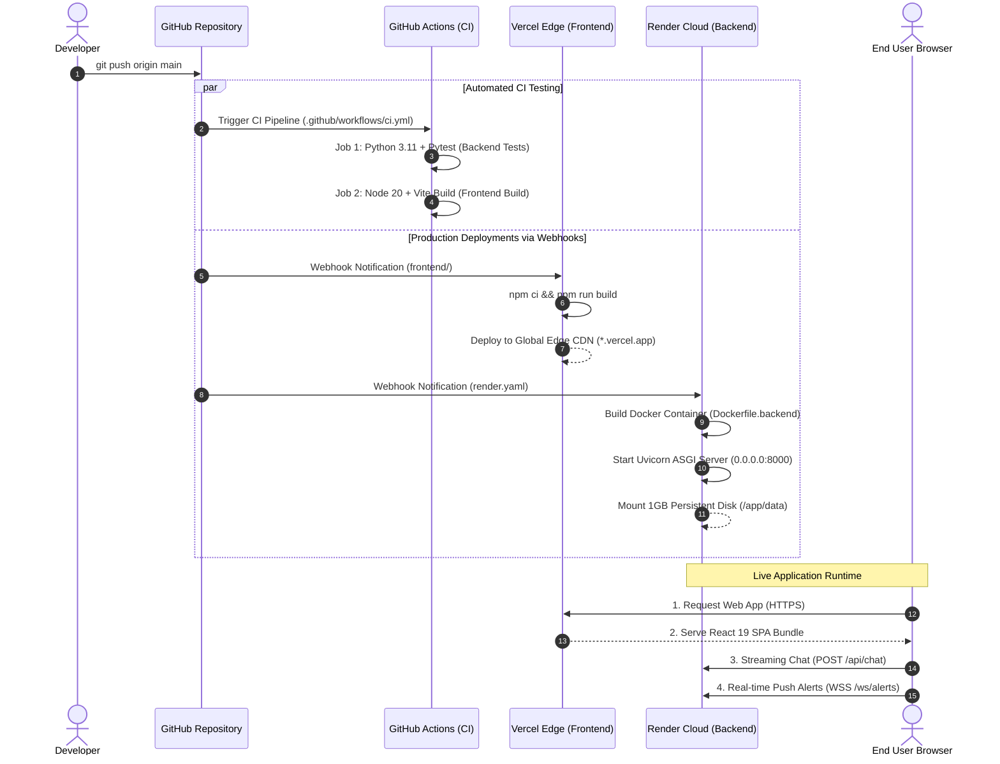

# HeatShield: Software Engineering & System Architecture Whitepaper

**Project Name:** HeatShield  
**Domain:** Urban Heat Resilience & Agentic Spatial Intelligence  
**Tech Stack:** Python (FastAPI, MCP SDK, Shapely) · React 19 (Vite, Leaflet, Recharts) · Meta PromptGuard · Open-Meteo & OpenStreetMap APIs  

---

## 📖 1. Engineering Glossary & Key Concepts

| Term | Full Name | Plain-English Software Engineering Definition |
| :--- | :--- | :--- |
| **gpm** | **Geopotential Meters** | The standard scientific unit measuring altitude in the atmosphere based on Earth's gravity and air pressure. At the 500hPa level, heights $\ge 5920\text{ gpm}$ indicate an extreme, persistent **Heat Dome** (atmospheric lid trapping heat). |
| **hPa** | **Hectopascals** | The standard metric unit of atmospheric pressure ($1\text{ hPa} = 100\text{ Pascals} = 1\text{ millibar}$). Standard sea-level pressure is $\approx 1013.25\text{ hPa}$. Used in the 500hPa upper-troposphere layer to detect synoptic blocking ridges. |
| **WBGT** | **Wet Bulb Globe Temperature** | The international gold standard for human thermal stress. Combines air temperature, humidity (sweat evaporation limit), solar radiant heat, and wind cooling into a single actionable index. |
| **OSRM** | **Open Source Routing Machine** | A high-performance C++ routing engine for OpenStreetMap road networks. Computes real-world walking paths, road geometry, and pedestrian transit times instead of straight-line distance. |
| **Isochrone** | **Walkability Travel Polygon** | A closed geographical polygon showing all areas reachable on foot within a specific time limit (e.g., a 5-minute or 10-minute safe walking radius under heat exposure). |
| **RAG** | **Retrieval-Augmented Generation** | Grounding the LLM by dynamically fetching verified medical (CDC/NIOSH) and workplace safety protocols into the prompt context to eliminate hallucinations. |

---

## 🎯 2. The Problem Space & Core Mission

### The Problem
Traditional weather apps are **passive displays of isolated numbers**:
1. **Numbers without Context:** Displaying "32°C" ignores the fact that 32°C at 85% humidity creates lethal thermal strain, whereas 35°C in dry air is manageable.
2. **No Spatial Actionability:** They cannot calculate whether a pedestrian walking corridor is thermally safe, nor map shaded rest stops.
3. **No Emergency Clinical Guidance:** When an outdoor worker collapses, conventional weather apps offer zero triage protocols.

### The Solution: HeatShield
HeatShield is an **Autonomous Spatial Intelligence and Urban Thermal Safety Platform**. It converts natural language user requests (*"I need to walk to the market"*, *"My coworker collapsed on site"*, *"Is there a heat dome on the planet right now?"*) into coordinated actions: real-time climate data ingestion, deterministic biometeorological math, and dynamic map rendering.

---

## 🧠 3. Why Do We Need an LLM?

A traditional web app relies on static forms and rigid buttons. We use a **Large Language Model (LLM)** as the central reasoning orchestrator because:

1. **Natural Language Intent Parsing:** Users don't query APIs with coordinates and parameters. They speak naturally: *"Can my crew pour concrete safely this afternoon in Phoenix?"*
2. **Autonomous Multi-Step Planning:** The LLM reasons across multiple domains: Geocoding $\rightarrow$ Telemetry Fetch $\rightarrow$ Thermal Stress Math $\rightarrow$ Pedestrian Routing $\rightarrow$ Canvas UI Generation.
3. **Contextual Synthesis & Empathy:** Converts raw numerical sensor streams into prioritized, life-saving human advice tailored to the user's specific activity level.

---

## 💬 4. Multi-Turn Conversation Context & State Management

### Why Context Retention is Critical in Spatial AI
In spatial and environmental reasoning, users interact conversationally across multiple turns:
* **Turn 1:** *"How is the weather in Atlanta?"* $\rightarrow$ HeatShield fetches telemetry and sets the map view.
* **Turn 2:** *"Draw a 5 km buffer zone around it."* $\rightarrow$ The LLM resolves *"it"* as **Atlanta** using conversation history.

* **Client-Side:** `App.jsx` preserves conversational turn history in React state.
* **Server-Side:** `api.py` maintains a bounded 14-turn rolling history window inside the LLM context to guarantee entity resolution without exceeding token limits.

---

## 🔌 5. Why Does the LLM Need MCP (Model Context Protocol)?

LLMs in isolation suffer from two fundamental software limitations:
1. **Knowledge Cutoff & Sensor Blindness:** An LLM cannot query live weather satellites or read live GPS feeds.
2. **Arithmetic & Spatial Hallucination:** LLMs are probabilistic token predictors; they cannot reliably calculate complex biometeorological formulas or generate exact vector geometries inline.

### The MCP Solution
MCP provides an **open, standardized protocol (JSON-RPC)** that decouples the LLM "brain" from backend data and execution tools:

* **Contract-Driven Tool Execution:** Tools expose strict JSON schemas describing their parameters.
* **Deterministic Compute:** Complex biometeorological math (WBGT, NIOSH work/rest cycles) runs in pure Python, returning exact, verified outputs to the LLM.
* **Modularity:** New data sources or geographic engines can be plugged into the MCP server without altering the LLM reasoning loop.

---

## 🧰 6. Complete MCP Tool Suite (14 Primitives)

HeatShield organizes its 14 tools into three decoupled, single-responsibility layers:

### A. Data Ingestion & Retrieval Layer (7 Tools)
* `get_weather_and_heat_risk`: Ingests live temperature, humidity, wind, solar radiation, and hourly UV index.
* `get_air_quality_forecast`: Fetches 5-day atmospheric pollutant forecasts (US AQI, PM2.5, PM10, Ozone).
* `geocode_location`: Multi-provider geocoder (Instant Local Cache $\rightarrow$ Open-Meteo Geocoding API $\rightarrow$ OSM Nominatim).
* `find_cooling_spots`: Queries OpenStreetMap Overpass for air-conditioned public spaces, shaded parks, and water fountains.
* `get_walking_route`: Generates pedestrian geometry, route distance, and walking duration via OSRM.
* `get_heat_dome_footprint`: **(Global & Regional Synoptic Engine)** Scans 7 planetary high-pressure corridors or validates live local 500hPa geopotential heights ($\ge 5920\text{ gpm}$).
* `query_emergency_protocols`: **(RAG Retrieval)** Performs semantic vector similarity search over CDC/NIOSH emergency medical guidelines in ChromaDB.

### B. Pure Deterministic Compute Layer (3 Tools — Zero I/O, Pure Math)
* `compute_wbgt`: Calculates Wet Bulb Globe Temperature based on the Australian BOM formula with outdoor solar and wind cooling adjustments.
* `compute_work_rest_cycle`: Evaluates official NIOSH/OSHA work/rest ratios (e.g., 15 min work / 45 min rest) and hourly hydration requirements based on workload intensity.
* `compute_heat_risk`: Categorizes environmental risk into standard WHO/CDC tiers (LOW, MODERATE, HIGH, EXTREME).

### C. Canvas UI Layer (4 Tools — Generative Map & Visuals)
* `draw_map_layer`: Renders custom GeoJSON polygons, thermal corridors, and isochrones directly on the Leaflet map canvas.
* `set_camera_view`: Dynamically navigates and zooms the map camera to target coordinates worldwide.
* `open_comparison_view`: Mounts side-by-side multi-city comparative data matrices onto the canvas dock.
* `open_chart_panel`: Renders interactive time-series line and dual-axis charts on the canvas dock.

---

## 🌪️ 7. The Synoptic Heat Dome Engine: Global Scanning & Truthfulness

Heat Domes are not arbitrary circles drawn on a map. They are **physical atmospheric phenomena** where the upper-tropospheric 500hPa pressure surface rises above **5,920 gpm**, trapping and compressing heat.

### The 7 Monitored Planetary Corridors:
1. **North American Plains Ridge** (Central USA / Texas / Oklahoma)
2. **Sonoran / Great Basin Dome** (Southwest USA & NW Mexico)
3. **Persian Gulf / Arabian Dome** (Middle East & Arabian Peninsula)
4. **Sahara / Central Mediterranean** (North Africa & Southern Italy)
5. **Iberian Peninsula** (Spain & Western Mediterranean)
6. **Indus Valley** (Pakistan & NW India)
7. **Western Pacific Subtropical High** (East Asia / Yangtze Basin)

---

## 📚 8. Why Did We Use RAG (Retrieval-Augmented Generation)?

In life-safety and occupational medicine, **hallucinations are dangerous**. An LLM cannot be allowed to guess symptoms or fabricate first-aid protocols.

1. **Grounded Medical Triage:** When a user reports a collapsed coworker who has stopped sweating, HeatShield retrieves official CDC/NIOSH triage knowledge from ChromaDB $\rightarrow$ identifies Heat Stroke $\rightarrow$ triggers the critical *"Cool First, Transport Second"* protocol.
2. **Grounded Workplace Standards:** Retrieves uncompromised NIOSH/OSHA standards for metabolic workload categories (Light, Moderate, Heavy) ensuring legally compliant guidance.

---

## 🔒 9. Security, Threat Model & PromptGuard Architecture

Civic and life-safety systems require strict protection against malicious prompt injections, jailbreaks, mission drift, and unauthorized escalations.

### Defense-in-Depth Tiers:
1. **Tier 1: Fast-Path Deterministic Guard ($<0.1\text{ ms}$ latency):** Instantly intercepts known adversarial patterns (`"ignore previous instructions"`, `"system prompt verbatim"`, `"DAN mode"`) in $<0.1\text{ ms}$ without wasting API tokens.
2. **Tier 2: Domain Boundary Enforcer:** Blocks explicit non-domain tasks (video game builds, coding scripts, creative writing, recipes) before they reach the LLM.
3. **Tier 3: Meta-Llama `Prompt-Guard-86M` Integration:** Deep transformer-based classifier scanning input embeddings (~150-250ms latency via HF API) for obfuscated adversarial tokens.
4. **Tier 4: Client-Side DOMPurify Sanitization:** All dynamic HTML rendered inside Leaflet map popups passes through `DOMPurify.sanitize()` to eliminate Cross-Site Scripting (XSS) risks.
5. **Tier 5: Emergency Broadcast Authorization Gate:** Architectural policy preventing an unverified user chat message from triggering a global public siren across all connected displays without an explicit human-in-the-loop confirmation modal.

---

## 🚀 10. Real-World Deployment Architecture (Vercel + Render + GitHub Actions)

HeatShield is deployed via modern, serverless cloud platforms connected directly to GitHub:

### Infrastructure Summary:

| Component | Platform | Configuration & Runtime | Role |
| :--- | :--- | :--- | :--- |
| **Frontend SPA** | **Vercel** | Node 20 · Vite Production Build · Global Edge CDN | Delivers the React 19 UI, Leaflet vector maps, and Recharts dashboards with global low-latency caching. |
| **Backend API** | **Render** | Docker Container (`Dockerfile.backend`) · Python 3.11 · `uv` | Runs FastAPI with Uvicorn ASGI workers for streaming responses (`/api/chat`) and WebSocket connections (`/ws/alerts`). |
| **MCP Engine** | **Render** | Subprocess via `mcp` stdio IPC | Isolated Python subprocess executing 14 data and compute tools on behalf of the LLM. |
| **Persistent Volume** | **Render Disk** | 1GB Persistent Disk (`/app/data`) | Persists ChromaDB vector embeddings and DuckDB spatial caching across redeploys. |
| **Automated CI** | **GitHub Actions** | Ubuntu Runners (`.github/workflows/ci.yml`) | Validates Python pytest suites and frontend Vite builds on every push to `main`. |
